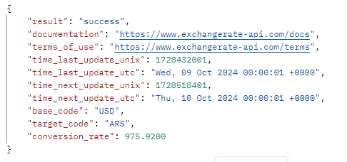
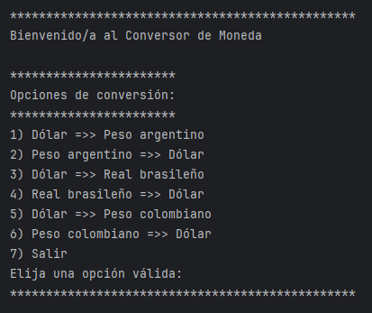
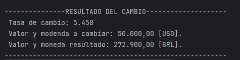

# Conversor de Monedas

Este es un proyecto para convertir entre diferentes monedas utilizando una API de tasas de cambio.

## Características

- Conversión entre:
    - Dólar (USD) ↔ Peso argentino (ARS)
    - Dólar (USD) ↔ Real brasileño (BRL)
    - Dólar (USD) ↔ Peso colombiano (COP)
- Utiliza la API de ExchangeRate para obtener las tasas de conversión en tiempo real. (https://www.exchangerate-api.com/)
- Formato de salida personalizado para mayor legibilidad.

## Requisitos

- Java 17 o superior.
- Google Gson library para parsear los resultados de la API.
- Conexión a Internet para consultar la API de tasas de cambio.

## Instalación

1. Clonar el repositorio.
2. agregar la librería Gson.
3. Configurar la API Key: La aplicación utiliza ExchangeRate-API para obtener la tasa de cambio. Regístrate y obtén una 
   API Key, luego reemplaza el valor en el archivo Consulta.java: String apiKey = "TU_API_KEY_AQUI";

## Ejemplo de Request y Response de la API

### Request
La aplicación realiza una solicitud GET a la API de Exchange Rate utilizando el siguiente formato de URL:
https://v6.exchangerate-api.com/v6/{apiKey}/pair/{monedaBase}/{monedaObjetivo}

Por ejemplo, si deseas convertir de Dólar (USD) a Peso argentino (ARS), el request sería:
https://v6.exchangerate-api.com/v6/{apiKey}/pair/USD/ARS

### Response
La respuesta de la API es un objeto JSON que incluye la tasa de conversión actual entre las dos monedas solicitadas,
y alguna información adicional.  
  
Un ejemplo de respuesta es:  

## Uso
1. Este es el menú que se presentará  
  

2. Selecciona la opción de monedas y el monto a convertir. Aquí tienes un ejemplo de la salida:  
  

3. Puedes realizar tantos cambios como desees, hasta que presiones la opción #7 que finalizará la aplicación

## Estructura del proyecto

ConversorDeMonedas/

    ├── calculos/
                Calculo.java        # Clase que realiza los cálculos de conversión y formateo de las salidas numéricas.
    ├── conversion/
                Consulta.java       # Clase que maneja la consulta de la tasa de cambio a la API.
                Tasa.java           # Clase que representa la tasa de cambio.
    ├── main/
                Principal.java      # Clase principal que contiene la interfaz de usuario.

## Pruebas Realizadas

### 1. Selección de opción no válida
- **Entrada**: Seleccionar un número fuera del rango permitido (por ejemplo, 8 o -1).
- **Resultado Esperado**: 
    - El sistema muestra el mensaje "Opción no válida, por favor ingrese un número entre 1 y 7."
    - El sistema vuelve a mostrar el menú. 
- **Resultado Obtenido**:
    - El sistema mostró correctamente el mensaje de error.
    - El sistema volvió a mostrar el menú.

### 2. Ingreso de caracteres no numéricos en la opción del menú
- **Entrada**: Ingresar caracteres no numéricos (por ejemplo, 'abc', '@') cuando se solicita la opción de conversión.
- **Resultado Esperado**: 
    - El sistema muestra el mensaje "Entrada no válida. Por favor, ingrese solo caracteres numéricos."
    - El sistema vuelve a mostrar el menú.
- **Resultado Obtenido**: 
    - El sistema mostró correctamente el mensaje de error. 
    - El sistema volvió a mostrar el menú.

### 3. Ingreso de valor a cambiar cero(0) o negativo 
- **Entrada**: Seleccionar una opción válida y luego ingresar un valor negativo o cero(0) (por ejemplo: 0, -100).
- **Resultado Esperado**: 
    - El sistema muestra el mensaje "El valor a convertir debe ser un número mayor que cero(0)."
    - El sistema vuelve a mostrar el menú.
- **Resultado Obtenido**: 
    - El sistema mostró correctamente el mensaje de error.
    - El sistema volvió a mostrar el menú.

### 4. Ingreso de caracteres no numéricos en el valor a convertir
- **Entrada**: Ingresar caracteres no numéricos (por ejemplo, 'abc', '@') cuando se solicita el valor a convertir.
- **Resultado Esperado**: 
    - El sistema muestra el mensaje "Entrada no válida. Por favor, ingrese solo números enteros."
    - El sistema vuelve a mostrar el menú.
- **Resultado Obtenido**: 
    - El sistema mostró correctamente el mensaje de error.
    - El sistema volvió a mostrar el menú.

### 5. Conversión válida: Dólar a Peso argentino
- **Entrada**: Seleccionar la opción 1 y un valor de 100 USD para convertir a ARS.
- **Resultado Esperado**: 
    - Tasa de cambio actualizada.
    - Valor y moneda a cambiar.
    - Valor y moneda resultado.
      
- **Resultado Obtenido**: 
    - Tasa de cambio: 975.5
    - Valor y moneda a cambiar: 100,00 [USD].
    - Valor y moneda resultado: 97.550,00 [ARS].

### 6. Conversión válida: Peso colombiano a Dólar
- **Entrada**: Seleccionar la opción 6 y un valor de 50000 COP para convertir a USD.
- **Resultado Esperado**: 
    - Tasa de cambio actualizada.
    - Valor y moneda a cambiar.
    - Valor y moneda resultado.
  
- **Resultado Obtenido**: 
    - Tasa de cambio: 0.00023946
    - Valor y modenda a cambiar: 50.000,00 [COP].
    - Valor y moneda resultado: 11,97 [USD].

### 7. Salida del programa
- **Entrada**: Seleccionar la opción 7.
- **Resultado Esperado**: 
    - El sistema muestra el mensaje "Saliendo del programa..." y finaliza la ejecución.
- **Resultado Obtenido**: 
    - El sistema salió correctamente y mostró el mensaje de salida.

